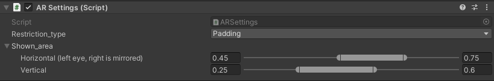
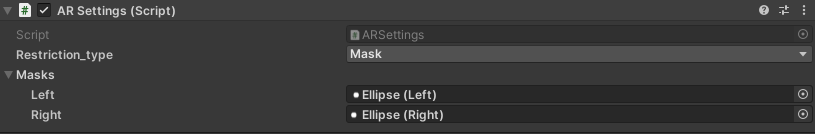
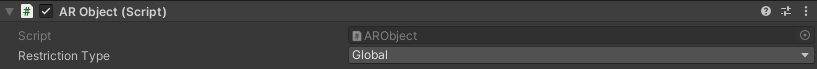
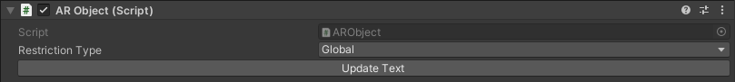
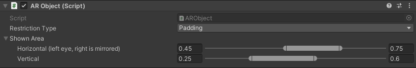
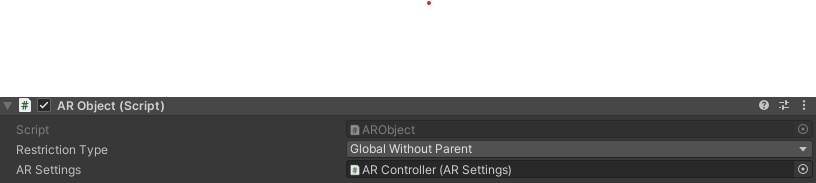

# How to setup the AR

You can have a look at the `AR/Example/Example` Scene as an example on how to use the AR System. The main components are explained in detail below.

## AR Dependencies

To add AR to a scene, add both the `Cameras` and the `AR Controller` prefabs from `AR/Exports`.

### AR Controller

#### Padding

With `Restriction Type = Padding` the FoV is controlled by the percentages that are shown.

In the example below, it would show everything that is in between 45% and 75% from left to right and in between 25% and 60% from bottom to top.

#### Mask

With `Restriction Type = Mask` the FoV is controlled by the two masks for left and right eye.

The `Mask` is multiplied with so that `White` will be displayed, and `Transparent` is hidden.

## AR Objects

Both Text (TextMeshPro) and Mesh AR-Objects are supported. For them to function correctly it is best to add them as children of a `AR Settings` Object (e.g. the `AR/Exports/AR Controller` Prefab), but you can also use `AR Objects` in either `Padding`, `Mask` or `Global Without Parent` mode on their own.

### Mesh

Simply add the `AR Object` script and apply a Material using the `AR/Textured` Shader (e.g. `AR/Exports/AR Base`)

You can also use the `AR/Exports/Mesh` prefab.

Basic usage using global FoV restrictions (This requires an `AR Settings` as a Parent):

### Text

To use `TextMeshPro` as AR you also need to add the `AR Object` Script as well as a `TMP_Font Asset` using the `AR/Text` Shader (e.g. `AR/Exports/AR Text Base`).

You can also use the `AR/Exports/Text` Prefab.

**Be aware that you need to call `ARObject.UpdateText()` after changing the text or it's attributes!**

Basic usage using global FoV restrictions (This requires an `AR Settings` as a Parent), note the Button `Update Text` you can use it to update update the Text of the children if you change the Text in the Inspector (while in playing mode):

### Restriction Modes

#### Global

This just uses the `Padding`/`Mask` of the Parent `AR Settings` (see above for [Mesh](#mesh) and [Text](#text)).

#### Padding

This applies the padding directly to the `AR Object` (see [AR Settings/Padding](#padding)):

#### Mask

This applies the masks directly to the `AR Object` (see [AR Settings/Mask](#mask)):

#### Global Without Parent

This uses the `Mask` or `Padding` of an `AR Setting` but does not require to be a child of one. It instead used the `AR Setting` that is Assigned:

## Tracking Delay

To apply a tracking delay to the `AR-Camera` you can change the `Delay` property of `Delayed Track Script` of `Cameras/AR Camera`.
